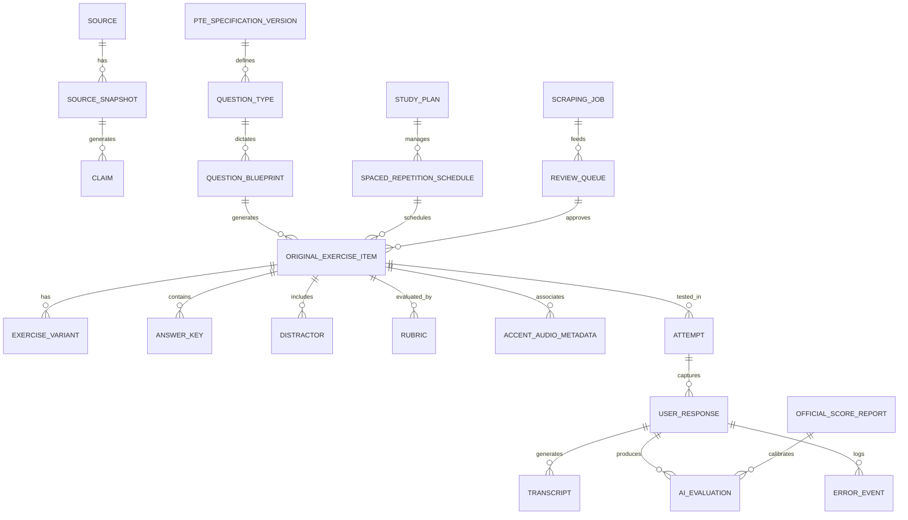

# Data Model Proposal: Unified Local Knowledge & Assessment Schema

> **Document Type:** Database Architecture & Entity-Relationship Specification  
> **Target RDBMS:** SQLite (Primary Embedded Default with WAL & JSON1) / PostgreSQL (Optional Docker Adapter)  
> **Specification Version:** 1.0.0  
> **Effective Date:** 2026-09-02  

---

## 1. Architectural Overview & Entity-Relationship Architecture

Database platform dirancang secara normalisasi tinggi untuk mendukung ketertelusuran penuh (*provenance*), audit kepatuhan hak cipta, evaluasi penilaian multi-skill, dan penjadwalan adaptif.



---

## 2. Table Definitions & Schema Catalog (30 Entities)

### Group 1: Provenance, Sources & Ingestion

```sql
-- 1. SOURCE
CREATE TABLE sources (
    source_id VARCHAR(64) PRIMARY KEY,
    title VARCHAR(255) NOT NULL,
    publisher VARCHAR(128) NOT NULL,
    url TEXT NOT NULL UNIQUE,
    source_tier VARCHAR(16) NOT NULL CHECK(source_tier IN ('Tier 1', 'Tier 2', 'Tier 3')),
    reliability_score REAL NOT NULL CHECK(reliability_score BETWEEN 0.0 AND 1.0),
    license_status VARCHAR(64) NOT NULL,
    content_type VARCHAR(64) NOT NULL,
    verification_status VARCHAR(32) NOT NULL DEFAULT 'UNVERIFIED',
    last_crawled_at TIMESTAMP,
    next_crawl_at TIMESTAMP,
    created_at TIMESTAMP DEFAULT CURRENT_TIMESTAMP,
    updated_at TIMESTAMP DEFAULT CURRENT_TIMESTAMP
);

-- 2. SOURCE_SNAPSHOT
CREATE TABLE source_snapshots (
    snapshot_id VARCHAR(64) PRIMARY KEY,
    source_id VARCHAR(64) NOT NULL REFERENCES sources(source_id) ON DELETE CASCADE,
    content_hash VARCHAR(64) NOT NULL, -- SHA-256
    http_etag VARCHAR(128),
    http_last_modified VARCHAR(128),
    extracted_text TEXT,
    extracted_metadata JSON,
    raw_payload_path TEXT,
    captured_at TIMESTAMP DEFAULT CURRENT_TIMESTAMP
);

-- 3. CLAIM
CREATE TABLE claims (
    claim_id VARCHAR(64) PRIMARY KEY,
    source_snapshot_id VARCHAR(64) REFERENCES source_snapshots(snapshot_id) ON DELETE SET NULL,
    claim_text TEXT NOT NULL,
    domain_topic VARCHAR(64) NOT NULL,
    classification VARCHAR(32) NOT NULL CHECK(classification IN (
        'VERIFIED_TRUE', 'OUTDATED_SUPERSEDED', 'COMMUNITY_STRATEGY', 'POTENTIALLY_DANGEROUS', 'UNSOURCED'
    )),
    authority_reference TEXT,
    remediation_action TEXT,
    verified_at TIMESTAMP DEFAULT CURRENT_TIMESTAMP
);

-- 4. SCRAPING_JOB
CREATE TABLE scraping_jobs (
    job_id VARCHAR(64) PRIMARY KEY,
    mode VARCHAR(16) NOT NULL CHECK(mode IN ('TRUSTED', 'DISCOVERY')),
    target_url TEXT NOT NULL,
    status VARCHAR(32) NOT NULL CHECK(status IN ('PENDING', 'RUNNING', 'COMPLETED', 'FAILED', 'PAUSED', 'QUARANTINED')),
    items_crawled INTEGER DEFAULT 0,
    items_quarantined INTEGER DEFAULT 0,
    error_message TEXT,
    started_at TIMESTAMP,
    completed_at TIMESTAMP,
    created_at TIMESTAMP DEFAULT CURRENT_TIMESTAMP
);

-- 5. REVIEW_QUEUE
CREATE TABLE review_queue (
    review_id VARCHAR(64) PRIMARY KEY,
    job_id VARCHAR(64) REFERENCES scraping_jobs(job_id) ON DELETE SET NULL,
    source_url TEXT NOT NULL,
    extracted_payload JSON NOT NULL,
    duplicate_similarity REAL DEFAULT 0.0,
    copyright_flag BOOLEAN DEFAULT FALSE,
    confidence_score REAL DEFAULT 0.0,
    ai_recommendation VARCHAR(16) CHECK(ai_recommendation IN ('APPROVE', 'EDIT', 'REJECT', 'FLAG')),
    review_status VARCHAR(16) DEFAULT 'PENDING' CHECK(review_status IN ('PENDING', 'APPROVED', 'REJECTED', 'FLAGGED')),
    reviewed_by VARCHAR(64),
    reviewed_at TIMESTAMP,
    created_at TIMESTAMP DEFAULT CURRENT_TIMESTAMP
);
```

---

### Group 2: PTE Specifications & Blueprints

```sql
-- 6. PTE_SPECIFICATION_VERSION
CREATE TABLE pte_specification_versions (
    spec_version VARCHAR(32) PRIMARY KEY,
    effective_date DATE NOT NULL,
    is_active BOOLEAN NOT NULL DEFAULT FALSE,
    statutory_functional_score INTEGER NOT NULL, -- e.g., 24 (post-Aug 2025) or 30 (pre-Aug 2025)
    safe_target_score INTEGER NOT NULL DEFAULT 36,
    total_parts INTEGER NOT NULL DEFAULT 3,
    total_question_types INTEGER NOT NULL,
    change_summary TEXT,
    created_at TIMESTAMP DEFAULT CURRENT_TIMESTAMP
);

-- 7. SKILL_SUBSKILL
CREATE TABLE skills_subskills (
    subskill_id VARCHAR(64) PRIMARY KEY,
    parent_skill VARCHAR(16) NOT NULL CHECK(parent_skill IN ('Speaking', 'Writing', 'Reading', 'Listening')),
    subskill_name VARCHAR(64) NOT NULL,
    description TEXT,
    gse_benchmark_range VARCHAR(32)
);

-- 8. QUESTION_TYPE
CREATE TABLE question_types (
    type_code VARCHAR(16) PRIMARY KEY, -- RA, RS, RTS, SGD, WFD, etc.
    name VARCHAR(64) NOT NULL,
    part_section VARCHAR(16) NOT NULL CHECK(part_section IN ('PART_1', 'PART_2', 'PART_3')),
    primary_skill VARCHAR(16) NOT NULL,
    cross_scoring_skill VARCHAR(16),
    scoring_mode VARCHAR(16) NOT NULL CHECK(scoring_mode IN ('PARTIAL_CREDIT', 'NEGATIVE_MARKING', 'BINARY')),
    default_prep_seconds INTEGER DEFAULT 0,
    default_response_seconds INTEGER NOT NULL,
    timer_type VARCHAR(16) NOT NULL CHECK(timer_type IN ('ITEM_INDEPENDENT', 'SECTION_SHARED')),
    template_risk_level VARCHAR(16) NOT NULL CHECK(template_risk_level IN ('NONE', 'LOW', 'MODERATE', 'HIGH', 'CRITICAL')),
    min_word_limit INTEGER,
    max_word_limit INTEGER,
    is_post_aug_2025_new BOOLEAN DEFAULT FALSE
);

-- 9. TOPIC
CREATE TABLE topics (
    topic_id VARCHAR(64) PRIMARY KEY,
    broad_domain VARCHAR(64) NOT NULL, -- Academic Science, Social Issues, Campus Life, Australia WHV Life
    topic_title VARCHAR(128) NOT NULL,
    vocabulary_collocations JSON,
    australia_practical_flag BOOLEAN DEFAULT FALSE
);

-- 10. DIFFICULTY
CREATE TABLE difficulty_levels (
    difficulty_id VARCHAR(16) PRIMARY KEY, -- EASY, MEDIUM, HARD, EXTREME
    gse_min INTEGER NOT NULL,
    gse_max INTEGER NOT NULL,
    wpm_speed_range VARCHAR(32),
    lexical_complexity_tier VARCHAR(16)
);

-- 11. CEFR_MAPPING
CREATE TABLE cefr_mappings (
    cefr_code VARCHAR(8) PRIMARY KEY, -- A1, A2, B1, B2, C1, C2
    gse_equivalent_min INTEGER NOT NULL,
    gse_equivalent_max INTEGER NOT NULL,
    whv_readiness_status VARCHAR(32) NOT NULL -- BELOW_STANDARD, FUNCTIONAL_BORDERLINE, SAFE_COMPETENT
);

-- 12. TARGET_SCORE
CREATE TABLE target_scores (
    target_id VARCHAR(32) PRIMARY KEY,
    name VARCHAR(64) NOT NULL,
    overall_min INTEGER NOT NULL,
    purpose_description TEXT NOT NULL
);

-- 13. QUESTION_BLUEPRINT
CREATE TABLE question_blueprints (
    blueprint_id VARCHAR(64) PRIMARY KEY,
    type_code VARCHAR(16) NOT NULL REFERENCES question_types(type_code),
    topic_id VARCHAR(64) REFERENCES topics(topic_id),
    target_difficulty VARCHAR(16) REFERENCES difficulty_levels(difficulty_id),
    prompt_structural_pattern TEXT NOT NULL,
    grammatical_focus TEXT,
    distractor_generation_rules JSON,
    audio_requirements JSON,
    created_at TIMESTAMP DEFAULT CURRENT_TIMESTAMP
);
```

---

### Group 3: Original Question Bank & Assessment Artifacts

```sql
-- 14. ORIGINAL_EXERCISE_ITEM
CREATE TABLE original_exercise_items (
    item_id VARCHAR(64) PRIMARY KEY,
    blueprint_id VARCHAR(64) NOT NULL REFERENCES question_blueprints(blueprint_id),
    type_code VARCHAR(16) NOT NULL REFERENCES question_types(type_code),
    prompt_text TEXT NOT NULL,
    prompt_image_path TEXT,
    prompt_audio_path TEXT,
    transcript_reference TEXT,
    cefr_level VARCHAR(8) REFERENCES cefr_mappings(cefr_code),
    difficulty_level VARCHAR(16) REFERENCES difficulty_levels(difficulty_id),
    estimated_time_seconds INTEGER NOT NULL,
    uniqueness_hash VARCHAR(64) NOT NULL,
    copyright_status VARCHAR(32) DEFAULT 'ORIGINAL_AI_SYNTHESIZED',
    approval_status VARCHAR(16) DEFAULT 'DRAFT' CHECK(approval_status IN ('DRAFT', 'APPROVED', 'REJECTED', 'FLAGGED')),
    generation_model VARCHAR(64),
    created_at TIMESTAMP DEFAULT CURRENT_TIMESTAMP
);

-- 15. EXERCISE_VARIANT
CREATE TABLE exercise_variants (
    variant_id VARCHAR(64) PRIMARY KEY,
    item_id VARCHAR(64) NOT NULL REFERENCES original_exercise_items(item_id) ON DELETE CASCADE,
    variant_label VARCHAR(32) NOT NULL, -- e.g. Alternate Accent AU/GB, Alternate Distractor Set
    prompt_variation_text TEXT,
    audio_asset_path TEXT,
    created_at TIMESTAMP DEFAULT CURRENT_TIMESTAMP
);

-- 16. ANSWER_KEY
CREATE TABLE answer_keys (
    key_id VARCHAR(64) PRIMARY KEY,
    item_id VARCHAR(64) NOT NULL REFERENCES original_exercise_items(item_id) ON DELETE CASCADE,
    accepted_canonical_text TEXT NOT NULL,
    alternate_spellings JSON, -- US vs UK variants: color/colour
    key_order INTEGER DEFAULT 1,
    points_weight REAL DEFAULT 1.0
);

-- 17. DISTRACTOR
CREATE TABLE distractors (
    distractor_id VARCHAR(64) PRIMARY KEY,
    item_id VARCHAR(64) NOT NULL REFERENCES original_exercise_items(item_id) ON DELETE CASCADE,
    distractor_text TEXT NOT NULL,
    distractor_archetype VARCHAR(32), -- False Friend, Near Homophone, Grammatical Mismatch, Opposite Meaning
    penalty_weight REAL DEFAULT 1.0
);

-- 18. RUBRIC
CREATE TABLE rubrics (
    rubric_id VARCHAR(64) PRIMARY KEY,
    type_code VARCHAR(16) NOT NULL REFERENCES question_types(type_code),
    metric_name VARCHAR(64) NOT NULL, -- Content, Oral Fluency, Pronunciation, Grammar, Form, Spelling
    max_score INTEGER NOT NULL,
    criteria_definitions JSON NOT NULL,
    zero_score_triggers JSON -- Conditions that trigger hard zero (e.g. Content=0, Silence>3s)
);

-- 19. ACCENT_AUDIO_METADATA
CREATE TABLE accent_audio_metadata (
    audio_id VARCHAR(64) PRIMARY KEY,
    item_id VARCHAR(64) REFERENCES original_exercise_items(item_id) ON DELETE CASCADE,
    file_path TEXT NOT NULL,
    duration_seconds REAL NOT NULL,
    accent_variety VARCHAR(16) NOT NULL CHECK(accent_variety IN ('AUSTRALIAN', 'BRITISH', 'AMERICAN', 'INTERNATIONAL')),
    speaker_gender VARCHAR(8) CHECK(speaker_gender IN ('MALE', 'FEMALE', 'MULTI')),
    words_per_minute REAL,
    audio_sample_rate INTEGER DEFAULT 16000,
    created_at TIMESTAMP DEFAULT CURRENT_TIMESTAMP
);
```

---

### Group 4: Student Attempts, Evaluation & Calibration

```sql
-- 20. ATTEMPT
CREATE TABLE attempts (
    attempt_id VARCHAR(64) PRIMARY KEY,
    session_mode VARCHAR(16) NOT NULL CHECK(session_mode IN ('DRILL', 'SECTION_TEST', 'FULL_MOCK')),
    started_at TIMESTAMP DEFAULT CURRENT_TIMESTAMP,
    completed_at TIMESTAMP,
    total_duration_seconds INTEGER,
    calculated_overall_score REAL,
    speaking_score REAL,
    writing_score REAL,
    reading_score REAL,
    listening_score REAL,
    confidence_interval_min REAL,
    confidence_interval_max REAL,
    readiness_status VARCHAR(32) -- NOT_READY, APPROACHING, READY_CONFIDENT
);

-- 21. USER_RESPONSE
CREATE TABLE user_responses (
    response_id VARCHAR(64) PRIMARY KEY,
    attempt_id VARCHAR(64) NOT NULL REFERENCES attempts(attempt_id) ON DELETE CASCADE,
    item_id VARCHAR(64) NOT NULL REFERENCES original_exercise_items(item_id),
    recorded_audio_path TEXT,
    submitted_text TEXT,
    time_spent_seconds REAL NOT NULL,
    response_timestamp TIMESTAMP DEFAULT CURRENT_TIMESTAMP
);

-- 22. TRANSCRIPT
CREATE TABLE transcripts (
    transcript_id VARCHAR(64) PRIMARY KEY,
    response_id VARCHAR(64) NOT NULL REFERENCES user_responses(response_id) ON DELETE CASCADE,
    full_transcript_text TEXT NOT NULL,
    word_timestamps JSON NOT NULL, -- [{word: "the", start: 0.1, end: 0.3, confidence: 0.94}, ...]
    pause_events JSON, -- [{start: 2.1, duration: 1.4}]
    calculated_wpm REAL,
    stt_model_used VARCHAR(32) NOT NULL
);

-- 23. AI_EVALUATION
CREATE TABLE ai_evaluations (
    eval_id VARCHAR(64) PRIMARY KEY,
    response_id VARCHAR(64) NOT NULL REFERENCES user_responses(response_id) ON DELETE CASCADE,
    item_score REAL NOT NULL,
    max_possible_score REAL NOT NULL,
    breakdown_json JSON NOT NULL, -- {content: 4, oral_fluency: 4, pronunciation: 3}
    structured_feedback_id TEXT NOT NULL, -- Bahasa Indonesia Actionable Advice
    confidence_rating REAL NOT NULL,
    template_detection_flag BOOLEAN DEFAULT FALSE,
    evaluated_at TIMESTAMP DEFAULT CURRENT_TIMESTAMP
);

-- 24. ERROR_EVENT
CREATE TABLE error_events (
    error_id VARCHAR(64) PRIMARY KEY,
    response_id VARCHAR(64) REFERENCES user_responses(response_id) ON DELETE CASCADE,
    error_type VARCHAR(32) NOT NULL, -- REPEAT_HESITATION, PLURAL_OMISSION, WFD_SPELLING, EXCESSIVE_PAUSE
    detected_token VARCHAR(64),
    suggested_correction VARCHAR(64),
    remedial_drill_recommended VARCHAR(64)
);

-- 25. OFFICIAL_SCORE_REPORT
CREATE TABLE official_score_reports (
    report_id VARCHAR(64) PRIMARY KEY,
    report_date DATE NOT NULL,
    overall_score INTEGER NOT NULL,
    speaking_score INTEGER NOT NULL,
    writing_score INTEGER NOT NULL,
    reading_score INTEGER NOT NULL,
    listening_score INTEGER NOT NULL,
    verified_document_path TEXT,
    personal_bias_offset REAL DEFAULT 0.0, -- Difference between AI estimate and Real Pearson
    created_at TIMESTAMP DEFAULT CURRENT_TIMESTAMP
);
```

---

### Group 5: Adaptive Learning, Spaced Repetition & Operations

```sql
-- 26. STUDY_PLAN
CREATE TABLE study_plans (
    plan_id VARCHAR(64) PRIMARY KEY,
    track_type VARCHAR(16) NOT NULL CHECK(track_type IN ('PTE_ACADEMIC', 'AUSTRALIA_PRACTICAL')),
    duration_weeks INTEGER NOT NULL CHECK(duration_weeks IN (2, 4, 8, 12)),
    daily_allocated_minutes INTEGER NOT NULL DEFAULT 60,
    exam_target_date DATE,
    diagnostic_initial_score REAL,
    current_day_index INTEGER DEFAULT 1,
    is_active BOOLEAN DEFAULT TRUE,
    created_at TIMESTAMP DEFAULT CURRENT_TIMESTAMP
);

-- 27. SPACED_REPETITION_SCHEDULE
CREATE TABLE spaced_repetition_schedules (
    schedule_id VARCHAR(64) PRIMARY KEY,
    plan_id VARCHAR(64) NOT NULL REFERENCES study_plans(plan_id) ON DELETE CASCADE,
    item_id VARCHAR(64) NOT NULL REFERENCES original_exercise_items(item_id),
    repetition_interval_days INTEGER DEFAULT 1,
    ease_factor REAL DEFAULT 2.5,
    streak_count INTEGER DEFAULT 0,
    next_review_date DATE NOT NULL,
    last_reviewed_at TIMESTAMP
);

-- 28. MODEL_RUN
CREATE TABLE model_runs (
    run_id VARCHAR(64) PRIMARY KEY,
    model_name VARCHAR(64) NOT NULL,
    task_type VARCHAR(32) NOT NULL, -- EVALUATION, ITEM_GENERATION, BLUEPRINT_SYNTHESIS
    duration_ms INTEGER NOT NULL,
    prompt_tokens INTEGER,
    completion_tokens INTEGER,
    status VARCHAR(16) NOT NULL,
    created_at TIMESTAMP DEFAULT CURRENT_TIMESTAMP
);

-- 29. BACKUP
CREATE TABLE backups (
    backup_id VARCHAR(64) PRIMARY KEY,
    backup_type VARCHAR(16) NOT NULL CHECK(backup_type IN ('FULL', 'DATA_ONLY', 'AUDIO_ONLY')),
    file_path TEXT NOT NULL,
    file_size_bytes BIGINT NOT NULL,
    checksum_sha256 VARCHAR(64) NOT NULL,
    created_at TIMESTAMP DEFAULT CURRENT_TIMESTAMP
);

-- 30. APPLICATION_SETTING
CREATE TABLE application_settings (
    setting_key VARCHAR(64) PRIMARY KEY,
    setting_value TEXT NOT NULL,
    data_type VARCHAR(16) DEFAULT 'STRING',
    description TEXT,
    updated_at TIMESTAMP DEFAULT CURRENT_TIMESTAMP
);
```

---

## 3. Data Integrity & Migration Strategy

*   **Mode Default (Zero-Setup):**  
    Database diinisialisasi secara otomatis sebagai file tunggal `data/app_storage.sqlite3` dengan mode **WAL (Write-Ahead Logging)** untuk memungkinkan konkurensi pembacaan oleh UI Next.js dan penulisan oleh Python background worker secara mulus tanpa locking error.
*   **Vector Search Fallback:**  
    Jika ekstensi `sqlite-vec` tidak terinstall, sistem menggunakan algoritma cosine similarity fallback berbasis Python NumPy secara langsung pada array embedding JSON.
*   **Prinsip Privasi Mutlak:**  
    Seluruh tabel berada di media penyimpanan lokal `D:\Hazza\Data Pribadi\ABROAD\data\`. Tidak ada data suara, teks jawaban, maupun hasil evaluasi yang dikirimkan ke cloud server mana pun.
