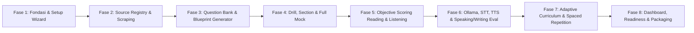

# Implementation Roadmap: 8-Phase Phased Delivery Architecture

> **Engineering Standard:** Strict Gate-Driven Modular Development  
> **Rule of Execution:** Implement exactly one phase at a time. Conclude each phase with tests, fixtures, smoke verification, and user approval gate. Never begin a subsequent phase without explicit sign-off.  
> **Status:** Specification Baseline (Awaiting Research Gate Approval)  
> **Effective Date:** 2026-09-02  

---

## 1. Phased Architecture Overview

---

## 2. Phase-by-Phase Execution Specifications

### Fase 1 — Fondasi Aplikasi, Setup Wizard, Database & Import Materi Lokal
*   **Fokus & Tujuan:**  
    Membangun struktur aplikasi lokal Next.js + TypeScript, inisialisasi database SQLite (dengan mode WAL), setup wizard pendeteksi spesifikasi komputer (Node.js, Python, RAM, GPU, Mikrofon, Ollama), dan modul impor untuk mengonversi materi draft lokal (`01_PTE_...`, `02_PTE_...`, `03_PTE_...`, `Dashboard.html`, `Daftar Nilai Ujian.pdf`) ke dalam skema database sebagai *Draft Legacy Reference*.
*   **File yang Dihasilkan/Diubah:**
    *   `src/app/setup/page.tsx`: Setup Wizard GUI (Hardware & Dependency Inspector).
    *   `src/lib/db/index.ts`: Database client (SQLite driver + migrations).
    *   `src/lib/importers/local_drafts.ts`: Script import file markdown & PDF ke DB.
    *   `scripts/hardware_probe.py`: Python probe untuk RAM, VRAM, mic, dan Ollama API.
*   **Automated Tests:**
    *   `tests/db_migration.test.ts`: Verifikasi pembuatan 30 tabel dan integritas foreign key.
    *   `tests/local_import.test.ts`: Verifikasi parsing konten lokal tanpa kehilangan data.
*   **Fixture Data:** `tests/fixtures/sample_draft.md`, `tests/fixtures/mock_probe_result.json`.
*   **Smoke Test Lokal:** Jalankan `npm run dev`, buka `http://localhost:3000/setup`, pastikan semua indikator hardware dan status import berstatus centang hijau (*Pass*).
*   **Known Limitations:** Belum ada fitur evaluasi audio atau generator soal otomatis.
*   **Next Phase Trigger:** Konfirmasi pengguna atas hasil migrasi DB dan kelulusan smoke test Fase 1.

---

### Fase 2 — Source Registry, Scraping Engine, Provenance & Review Console
*   **Fokus & Tujuan:**  
    Membangun engine crawling dua mode (Trusted Mode & Discovery Mode), quarantine queue, rate-limiting, deduplikasi hash SHA-256, dan antarmuka Review Console untuk mengelola sumber.
*   **File yang Dihasilkan/Diubah:**
    *   `scripts/worker/scraper.py`: Engine crawling dengan BeautifulSoup, pdfplumber, dan rate limiter.
    *   `src/app/admin/sources/page.tsx`: Antarmuka Source Registry & Quarantine Queue.
    *   `src/lib/services/quarantine.ts`: Logika filtering, hashing, dan deduplikasi.
*   **Automated Tests:**
    *   `tests/scraper_compliance.test.py`: Uji kepatuhan robots.txt, penolakan bypass CAPTCHA, dan backoff.
    *   `tests/deduplication.test.ts`: Uji deteksi duplikasi hash dan kesamaan leksikal.
*   **Fixture Data:** `tests/fixtures/sample_dha_page.html`, `tests/fixtures/sample_quarantine_item.json`.
*   **Smoke Test Lokal:** Jalankan scan Trusted Mode untuk `immi.homeaffairs.gov.au`, verifikasi payload tersimpan dengan hash valid di tabel `source_snapshots`.
*   **Known Limitations:** Ekstraksi audio dibatasi pada transkrip legal dan metadata publik.

---

### Fase 3 — Question Bank, Blueprint Engine & Original Question Generator
*   **Fokus & Tujuan:**  
    Membangun katalog blueprint soal untuk 22 tipe soal PTE Academic terbaru (termasuk *Respond to a Situation* dan *Summarize Group Discussion*), dan pipeline Ollama untuk mensintesis soal latihan 100% orisinal.
*   **File yang Dihasilkan/Diubah:**
    *   `src/lib/blueprints/index.ts`: Definisi parameter blueprint (CEFR, pola gramatikal, panjang kata).
    *   `scripts/worker/generator.py`: Generator soal via API lokal Ollama dengan prompt anti-plagiarisme.
    *   `src/app/admin/questions/page.tsx`: Admin console untuk review, edit, dan approval soal baru.
*   **Automated Tests:**
    *   `tests/blueprint_validation.test.ts`: Validasi struktur instruksi dan batas kata tiap tipe soal.
    *   `tests/originality_check.test.py`: Uji keunikan soal terhadap bank soal referensi ($>90\%$).
*   **Fixture Data:** `tests/fixtures/sample_blueprint_ra.json`, `tests/fixtures/generated_item_wfd.json`.
*   **Smoke Test Lokal:** Generate 3 soal orisinal WFD dan 2 soal RA via Ollama lokal, periksa apakah masuk ke status `PENDING_REVIEW` di Admin Console.

---

### Fase 4 — Interactive Practice Modes: Drill, Section Test & Full Mock Test
*   **Fokus & Tujuan:**  
    Mengembangkan antarmuka latihan interaktif: mode drill per tipe soal, section test per bagian, dan simulasi full mock test 2 jam 15 menit dengan batasan timer realistis dan aturan mikrofon 3 detik.
*   **File yang Dihasilkan/Diubah:**
    *   `src/app/practice/drill/[type]/page.tsx`: UI drill spesifik per tipe soal.
    *   `src/app/practice/mock/page.tsx`: Simulator ujian resmi non-stop (tanpa feedback sebelum submit).
    *   `src/components/audio/AudioRecorder.tsx`: Perekam audio browser dengan deteksi 3-second silence.
*   **Automated Tests:**
    *   `tests/timer_logic.test.ts`: Verifikasi countdown timer independen vs shared section timer.
    *   `tests/mic_silence_detector.test.ts`: Uji auto-stop perekaman saat audio hening 3 detik.
*   **Fixture Data:** `tests/fixtures/mock_exam_sequence.json`.
*   **Smoke Test Lokal:** Lakukan simulasi mini-test 5 soal Speaking, verifikasi audio tersimpan ke folder lokal `data/audio/`.

---

### Fase 5 — Objective Scoring Engine: Reading & Listening
*   **Fokus & Tujuan:**  
    Mengimplementasikan algoritma penilaian objektif deterministik untuk seluruh tipe soal Reading dan Listening: Fill in the Blanks, Multiple Choice (termasuk negative marking ber-floor 0), Re-order Paragraphs, dan Write From Dictation (partial credit).
*   **File yang Dihasilkan/Diubah:**
    *   `src/lib/scoring/objective.ts`: Engine penghitung skor objektif, negative marking, dan pair scoring.
    *   `src/lib/scoring/wfd_evaluator.ts`: Parser pencocokan kata WFD (toleransi kapitalisasi & variasi).
*   **Automated Tests:**
    *   `tests/negative_marking.test.ts`: Uji kasus salah memilih > benar memilih (skor wajib 0, tidak boleh minus).
    *   `tests/wfd_scoring.test.ts`: Uji partial credit kata benar dan verifikasi ketiadaan penalti kata ekstra.
*   **Fixture Data:** `tests/fixtures/wfd_test_cases.json`, `tests/fixtures/mcma_cases.json`.
*   **Smoke Test Lokal:** Submit tes 10 soal Reading & Listening, pastikan skor terhitung instan dan akurat.

---

### Fase 6 — AI Evaluation Engine: Ollama, STT, TTS, Speaking & Writing
*   **Fokus & Tujuan:**  
    Mengintegrasikan Faster-Whisper (STT) untuk transkrip suara pengguna dan Piper TTS untuk suara audio soal. Menghubungkan Ollama untuk penilaian Writing (Essay, SWT, SST) dan Speaking (Pronunciation, Fluency, Content) dengan output terstruktur JSON dan feedback Bahasa Indonesia.
*   **File yang Dihasilkan/Diubah:**
    *   `scripts/worker/stt_service.py`: Local speech-to-text service (Faster-Whisper).
    *   `scripts/worker/tts_service.py`: Local text-to-speech service (Piper TTS).
    *   `src/lib/ai/ollama_client.ts`: Adapter API localhost Ollama dengan retry, timeout, dan validasi JSON.
    *   `src/lib/scoring/speaking_evaluator.ts`: Analisis kelancaran (WPM, jeda) dan akurasi artikulasi.
*   **Automated Tests:**
    *   `tests/ollama_adapter.test.ts`: Uji respons validasi JSON dan penanganan timeout/offline.
    *   `tests/stt_timestamps.test.py`: Uji akurasi word timestamps dan deteksi jeda hening.
*   **Fixture Data:** `tests/fixtures/sample_audio.wav`, `tests/fixtures/sample_essay_response.txt`.
*   **Smoke Test Lokal:** Rekam 1 kalimat Read Aloud, jalankan STT + evaluasi AI, verifikasi feedback tampil dalam Bahasa Indonesia di layar.

---

### Fase 7 — Adaptive Curriculum, Remediasi & Spaced Repetition Engine
*   **Fokus & Tujuan:**  
    Membangun sistem onboarding adaptif (pilihan rencana 2, 4, 8, 12 minggu), tes diagnostik awal, algoritma pengulangan berjarak (*Spaced Repetition / SuperMemo SM-2*), daur ulang kesalahan (*error recycling*), dan modul sekunder terpisah *Australia Practical English*.
*   **File yang Dihasilkan/Diubah:**
    *   `src/lib/curriculum/scheduler.ts`: Algoritma SM-2 untuk jadwal latihan harian.
    *   `src/lib/curriculum/remediation.ts`: Pemetik topik remedial berdasarkan histori kesalahan berulang.
    *   `src/app/curriculum/practical-au/page.tsx`: Modul Bahasa Inggris Praktis Australia (Hospitality, Farm, Slang).
*   **Automated Tests:**
    *   `tests/spaced_repetition.test.ts`: Uji perhitungan interval hari berikutnya berdasarkan rating recall.
    *   `tests/adaptive_queue.test.ts`: Uji pembobotan soal terlemah yang muncul lebih sering.
*   **Fixture Data:** `tests/fixtures/sample_error_history.json`.
*   **Smoke Test Lokal:** Kerjakan beberapa soal salah, verifikasi item tersebut terjadwal ulang pada queue esok hari.

---

### Fase 8 — Executive Dashboard, Readiness Analytics, Local Backup & Packaging
*   **Fokus & Tujuan:**  
    Menyempurnakan antarmuka Dashboard utama: indikator kesiapan visa (*Readiness Status: Belum Siap / Mendekati / Siap dengan Confidence*), grafik tren skor, kalibrasi skor riil Pearson, sistem backup lokal otomatis (ekspor/impor ZIP terenkripsi), dan panduan instalasi lengkap offline.
*   **File yang Dihasilkan/Diubah:**
    *   `src/app/dashboard/page.tsx`: Dashboard eksekutif modern (Next.js + Vanilla CSS tokens).
    *   `src/lib/analytics/readiness.ts`: Algoritma probabilitas kelulusan target 24 & 36+.
    *   `scripts/backup_manager.py`: Script backup/restore database dan file audio lokal.
    *   `README.md`: Panduan instalasi dan pengoperasian lokal tanpa koneksi internet.
*   **Automated Tests:**
    *   `tests/readiness_calculation.test.ts`: Uji keakuratan penentuan status kesiapan dari 3 mock terakhir.
    *   `tests/backup_restore.test.py`: Uji dump database, enkripsi, dan restore tanpa korupsi data.
*   **Fixture Data:** `tests/fixtures/mock_history_ready.json`, `tests/fixtures/mock_history_unready.json`.
*   **Smoke Test Lokal:** Lakukan simulasi ekspor backup, hapus sesi uji coba, lalu restore dan pastikan data kembali utuh.

---

## 3. Aturan Gerbang & Kriteria Selesai (*Definition of Done*)

Sebuah fase **HANYA DAPAT DIANGGAP SELESAI** jika:
1.  Semua automated test pada fase tersebut lulus 100%.
2.  Smoke test lokal pada antarmuka web berhasil dijalankan tanpa error console.
3.  Laporan capaian fase (*Phase Walkthrough & Artifact Summary*) disajikan kepada pengguna.
4.  Agen **berhenti** dan menunggu persetujuan eksplisit pengguna sebelum melangkah ke fase berikutnya.
