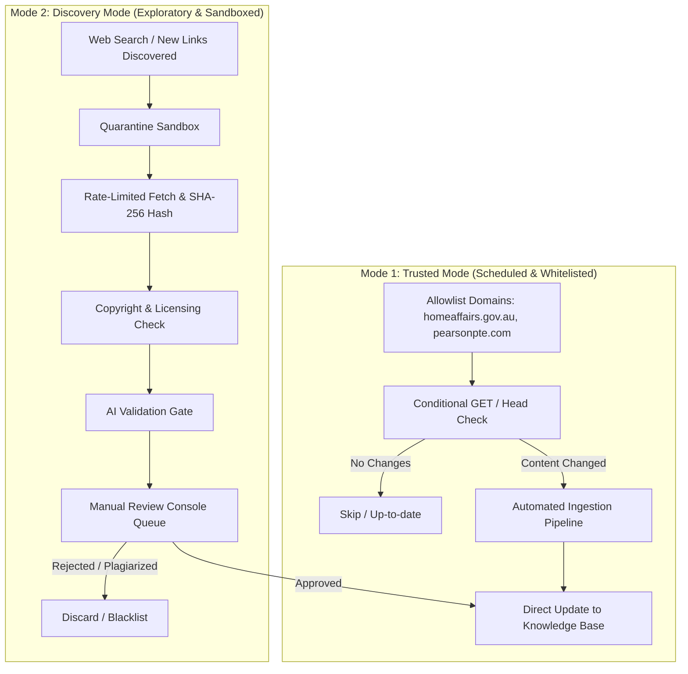

# Scraping & Ingestion Policy: Architecture, Compliance & Quarantine Pipeline

> **Document Type:** Technical Architecture Specification & Crawling Governance  
> **System Component:** Autonomous Research & Knowledge Ingestion Engine  
> **Execution Environment:** Local Python Ingestion Worker (`scripts/worker/`)  
> **Status:** Approved Baseline Specification  
> **Effective Date:** 2026-09-02  

---

## 1. Dual-Mode Architecture

Untuk menjamin kepatuhan hukum penuh dan mencegah pencemaran data (*data poisoning*) ke dalam sistem kurikulum, engine scraping dirancang dalam dua mode operasional yang terisolasi:



### 1.1. Trusted Mode (Strict Allowlist)
*   **Target Domain:** Hanya domain institusi resmi yang disetujui secara eksplisit:
    *   `*.homeaffairs.gov.au` (Statutory Visa Rules & Table Schedules)
    *   `*.legislation.gov.au` (Federal Register of Legislation)
    *   `*.pearsonpte.com` (Official Test Specifications, Test Centres & Score Guides)
*   **Otoritas:** Perubahan konten yang terdeteksi pada Trusted Mode dapat diperbarui ke dalam sistem referensi setelah melewati hashing dan verifikasi skema otomatis.

### 1.2. Discovery Mode (Quarantine-First)
*   **Mekanisme:** Menemukan tautan baru dari pencarian web atau input manual pengguna.
*   **Isolasi Total (*Zero Trust*):** Setiap URL atau materi baru **wajib masuk ke tabel `quarantine_queue`**.
*   **Larangan Mutlak:** Tidak ada data dari Discovery Mode yang boleh masuk ke bank soal atau memodifikasi aturan kurikulum sebelum melalui inspeksi manual pengguna di *Admin Console*.

---

## 2. Pipa Data Wajib (14-Stage Ingestion Pipeline)

Setiap proses crawling wajib melewati urutan tahapan berikut tanpa melewati satu tahap pun:

```
1. Source Discovery
      │
2. Allowlist vs Quarantine Routing
      │
3. Rate-Limited Polite Fetching (Respect robots.txt & backoff)
      │
4. Metadata Capture & SHA-256 Checksum Hashing
      │
5. Content Extraction (HTML, PDF text, Tables, Official Transcripts)
      │
6. Text Normalization & Unicode Sanitization
      │
7. Deduplication Check (Exact Hash & MinHash LSH)
      │
8. Source Classification (Tier 1 Statutory / Tier 2 Corroborative / Tier 3 Exploratory)
      │
9. Relevance & Pedagogical Alignment Scoring
      │
10. Copyright & Licensing Detection (Filter out paywalled/full-book dumps)
      │
11. Local AI Review (Ollama summarizes claims & checks anomalies)
      │
12. Admin Review Queue Presentation (UI Diff & Evidence Preview)
      │
13. Explicit Manual User Approval
      │
14. Publication to Production Knowledge Base
```

---

## 3. Batasan Kepatuhan & Etika Scraping (*Hard Constraints*)

Engine scraping lokal harus mematuhi batasan teknis berikut:

1.  **Kepatuhan `robots.txt` Mutlak:**  
    Sebelum mengunduh dokumen dari domain mana pun, crawler wajib mem-parsing `robots.txt`. Jika path dilarang (*Disallow*), crawler harus segera membatalkan tugas.
2.  **Dilarang Melewati Autentikasi, Paywall, atau CAPTCHA:**  
    Sistem tidak boleh memiliki mekanisme pemecah CAPTCHA, bypass Cloudflare, atau injeksi cookie curian. Jika sebuah halaman meminta login berbayar atau memunculkan tantangan bot, proses harus segera dihentikan dan ditandai `BLOCKED_BY_ACCESS_CONTROL`.
3.  **Polite Rate Limiting & Crawl Delay:**  
    *   Minimum jeda antar-request ke domain yang sama: **3.0 detik**.
    *   Header User-Agent wajib transparan dan informatif:  
        `User-Agent: HazzaAbroad-PTE-ResearchBot/1.0 (+https://localhost/bot-info; personal educational research)`
4.  **Exponential Backoff & Circuit Breaker:**  
    Jika menerima respons HTTP 429 (Too Many Requests) atau 503 (Service Unavailable):
    *   Attempt 1: Jeda 10 detik.
    *   Attempt 2: Jeda 30 detik.
    *   Attempt 3: Jeda 120 detik.
    *   Jika masih gagal, hentikan tugas (*circuit breaker open*) dan catat ke `scraping_error_logs`.
5.  **Stateful Pause & Resume:**  
    Crawler menyimpan progres URL per batch ke SQLite. Jika komputer mati atau dimatikan, proses dapat dilanjutkan tanpa mengulang crawl dari awal.
6.  **Penyimpanan Data Berhak Cipta:**  
    Dilarang menyimpan teks penuh dokumen komersial berhak cipta. Sistem hanya menyimpan:
    *   URL & domain.
    *   Tanggal akses & ETag HTTP.
    *   Checksum SHA-256.
    *   Ringkasan blueprint (panjang teks, topik, daftar kolokasi).
    *   Kutipan pendek ($< 250$ karakter) untuk penegasan sitasi.

---

## 4. Jadwal Eksekusi Sistem (Crawl Schedules)

| Jenis Eksekusi | Frekuensi | Target Domain | Aksi & Scope |
| :--- | :--- | :--- | :--- |
| **Deep Crawl Instalasi** | Sekali saat Setup Wizard | Tier 1 (DHA, Pearson) | Ingest standar awal, spesifikasi format, dan regulasi visa terkini. |
| **Lightweight Statutory Scan** | Harian (Background Cron) | `immi.homeaffairs.gov.au` | Cek header `ETag` dan `Last-Modified` pada halaman Functional English. Ringan & zero bandwidth. |
| **Incremental Educational Scan**| Mingguan | Tier 1 Pearson & Tier 2 Mitra | Update lokasi test center Indonesia, info biaya, dan tanggal rilis Score Guide baru. |
| **On-Demand Manual Scan** | Sesuai permintaan pengguna | URL spesifik input manual | Eksekusi langsung melalui Admin Console dengan status awal masuk Quarantine. |
