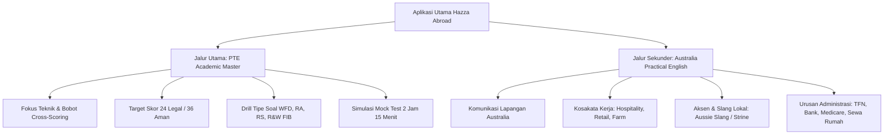

# Australian WHV Subclass 462: Functional English & Visa Compliance Blueprint

> **Jurisdiction:** Commonwealth of Australia — Department of Home Affairs  
> **Target Visa:** Work and Holiday (Subclass 462) — Indonesia Agreement  
> **Document Status:** Authoritative Statutory Synthesis & Audit  
> **Last Updated:** 2026-09-02  

---

## 1. Statutory Framework for Indonesian Citizens

Berdasarkan perjanjian bilateral antara Pemerintah Australia dan Pemerintah Republik Indonesia, pemegang paspor Indonesia yang mengajukan **Work and Holiday Visa (Subclass 462)** wajib memenuhi 4 pilar persyaratan utama:

1.  **Usia:** Berusia antara 18 hingga 30 tahun (inklusif) pada saat aplikasi visa diserahkan.
2.  **Surat Dukungan Pemerintah RI (SDUWHV):** Wajib mengantongi Surat Dukungan dari Direktorat Jenderal Imigrasi RI (Kemenkumham).
3.  **Kualifikasi Pendidikan Formal:** Telah lulus pendidikan tinggi (Diploma/Sarjana) ATAU telah berhasil menyelesaikan minimal **2 tahun (4 semester)** studi sarjana (S1) pada perguruan tinggi terakreditasi.
4.  **Kemampuan Bahasa Inggris:** Wajib membuktikan tingkat kemahiran bahasa Inggris minimal setingkat **Functional English**.

---

## 2. Audit Dokumen Lokal: `Daftar Nilai Ujian.pdf`

Pada inspeksi workspace, ditemukan file `D:\Hazza\Data Pribadi\ABROAD\Daftar Nilai Ujian.pdf`. Berdasarkan hasil audit OCR dan visual terhadap dokumen resmi tersebut:

*   **Identitas Pemilik:** Hazza Bhaskara Hedyana Putra (NIM: 057874637).
*   **Institusi Penerbit:** Universitas Terbuka (Kementerian Pendidikan Tinggi, Sains, dan Teknologi RI).
*   **Program Studi:** S1 Akuntansi (UPBJJ-UT Jakarta).
*   **Status Akademik:** Telah menempuh masa ujian 20252 dengan perolehan 19 SKS lulus dan Indeks Prestasi Semester (IPS) **3.84**.
*   **Tanggal Cetak:** 27 Juli 2026.

### Kedudukan Hukum Dokumen:
1.  **Valid untuk Syarat Pendidikan SDUWHV / WHV:**  
    Dokumen ini merupakan bukti progres perkuliahan S1 resmi. Jika dikombinasikan dengan transkrip semester sebelumnya sehingga total mencapai $\ge 2$ tahun masa studi (atau ijazah jika sudah lulus), dokumen ini **memenuhi pilar syarat kualifikasi pendidikan**.
2.  **TIDAK BISA Digunakan untuk Syarat Bahasa Inggris (Functional English):**  
    Department of Home Affairs Table 1 hanya membebaskan tes bahasa Inggris jika seluruh perkuliahan diselenggarakan dalam bahasa Inggris (*"all instruction was in English"*). Karena Universitas Terbuka menggunakan bahasa Indonesia sebagai bahasa pengantar utama, dokumen ini **tidak dapat menggantikan sertifikat tes bahasa Inggris**. Pengguna tetap **100% wajib mengikuti tes resmi (PTE Academic)**.

---

## 3. Syarat Resmi Functional English: Watershed Perubahan 7 Agustus 2025

Sebelum 7 Agustus 2025, standar baku PTE Academic untuk Functional English adalah Overall Score 30.  
Pada **7 Agustus 2025**, Department of Home Affairs menerbitkan instrumen peraturan baru dengan klasifikasi tabel berjenjang:

### Tabel Ketentuan Skor Resmi DHA:

| Kategori Tes | Tanggal Ujian | Jenis Tes yang Diakui | Syarat Skor Minimum | Masa Berlaku Dokumen |
| :--- | :--- | :--- | :--- | :--- |
| **Format Lama (Table 3)** | Diambil pada atau sebelum **6 Agustus 2025** | PTE Academic (Legacy) | **Overall Band Score $\ge 30$** | Berlaku 12 bulan sejak tanggal tes (paling lambat s.d. **6 Agustus 2026**) |
| **Format Baru (Table 2)** | Diambil pada atau setelah **7 Agustus 2025** | PTE Academic (Updated Format) | **Overall Band Score $\ge 24$** | Berlaku 12 bulan sejak tanggal tes |

### Ketentuan Kritis Tambahan:
*   **TIDAK ADA Batas Minimum Per Skill (No Component Minimums):**  
    Untuk Subclass 462 Functional English, DHA Table 2 hanya menetapkan *"An overall band score of at least 24"*. Tidak ada kewajiban bahwa Speaking, Writing, Reading, atau Listening harus mencapai angka tertentu, selama nilai komposit akhir mencapai $\ge 24$.
*   **Masa Berlaku Hasil Tes: Tepat 12 Bulan:**  
    Tes harus diambil dalam kurun waktu **maksimal 12 bulan sebelum tanggal pengajuan visa**. (Catatan: Pearson mencetak masa berlaku sertifikat 2 tahun, namun hukum imigrasi Australia membatasi khusus visa Functional English hanya 12 bulan).
*   **Larangan Mutlak Tes Online / At-Home:**  
    DHA secara tegas **menolak** seluruh tes berbasis daring jarak jauh (*remote-proctored*), termasuk *PTE Academic Online*. Ujian wajib diambil langsung di Pusat Tes Resmi (*Secure Test Centre*). Menggunakan hasil tes online berakibat penolakan visa otomatis (*visa refusal*).

---

## 4. Analisis Strategis: Mengapa Menargetkan Skor Aman 36+?

Secara legal, skor 24 (atau 30 pada sistem lama) sudah meluluskan visa. Namun, platform intelijen ini menetapkan **Target Latihan Aman pada Skor 36+** dengan pertimbangan teknis dan praktis:

```
[Skala PTE: 10 - 90]
  10           24          30            36+                         90
  |-------------|-----------|-------------|---------------------------|
  [Gagal Visa]  [Batas Legal] [Legacy Baseline] [Target Aman Platform] [Proficient / Superior]
```

1.  **Buffer Fluktuasi Ujian:**  
    Kondisi hari ujian (suara bising peserta lain, mikrofon asing, gugup, batuk) dapat menyebabkan deviasi skor sekitar $\pm 4 - 6$ poin. Target latihan 36 memastikan bahwa pada skenario terburuk sekalipun, skor riil tetap mendarat di atas 24.
2.  **CEFR A2 ke B1:**  
    Skor 24 berada di perbatasan A2 (Elementary). Skor 36 mencerminkan kompetensi B1 (Threshold/Intermediate), di mana peserta memiliki kejelasan artikulasi yang jauh lebih stabil di hadapan algoritma pengenal suara Pearson.
3.  **Kesiapan Hidup Nyata di Australia:**  
    Mendapatkan visa adalah langkah awal; bertahan hidup di Australia membutuhkan kemampuan komunikasi praktis.

---

## 5. Pemisahan Dua Jalur (Two-Track Architecture)

Aplikasi harus secara tegas memisahkan dua kurikulum:



*   **Jalur Utama (PTE Academic):**  
    Didominasi oleh strategi ujian efisien, optimalisasi oral fluency, penguasaan *Write From Dictation*, *Read Aloud*, *Repeat Sentence*, dan manajemen waktu. Kemajuan diukur dengan metrik skor GSE (10–90).
*   **Jalur Sekunder (Bahasa Inggris Praktis Australia):**  
    Modul opsional terpisah tanpa tekanan skor ujian. Memuat skenario nyata: wawancara kerja *casual*, istilah *RSA (Responsible Service of Alcohol)*, komunikasi saat *fruit picking*, memahami instruksi cepat manajer lokal, dan frasa darurat.
